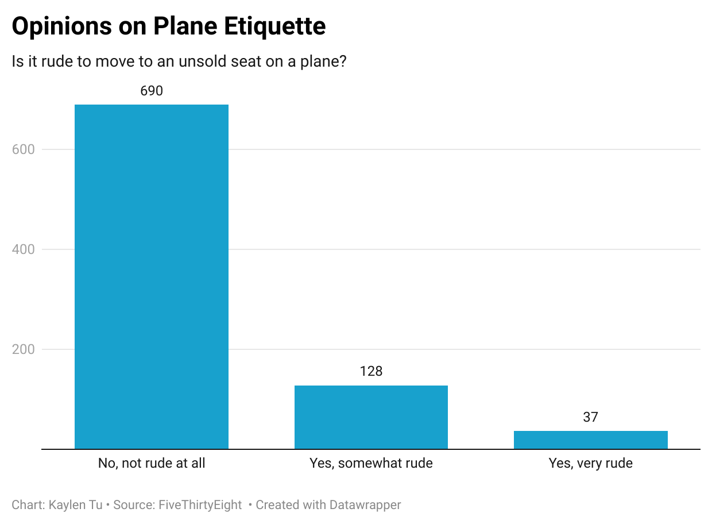

# Data Journalism 124

## What was interesting about the dataset?
I chose this questions because I thought the answers would be a resounding "No, it's not rude at all". I was surprised to see that the answers varied slightly and some people were of the opinion that it was in fact rude to sit in an unsold seat. The chart shows that the majority of people did not find it rude, however, almost 20% believed it to be either very rude or somewhat rude.
